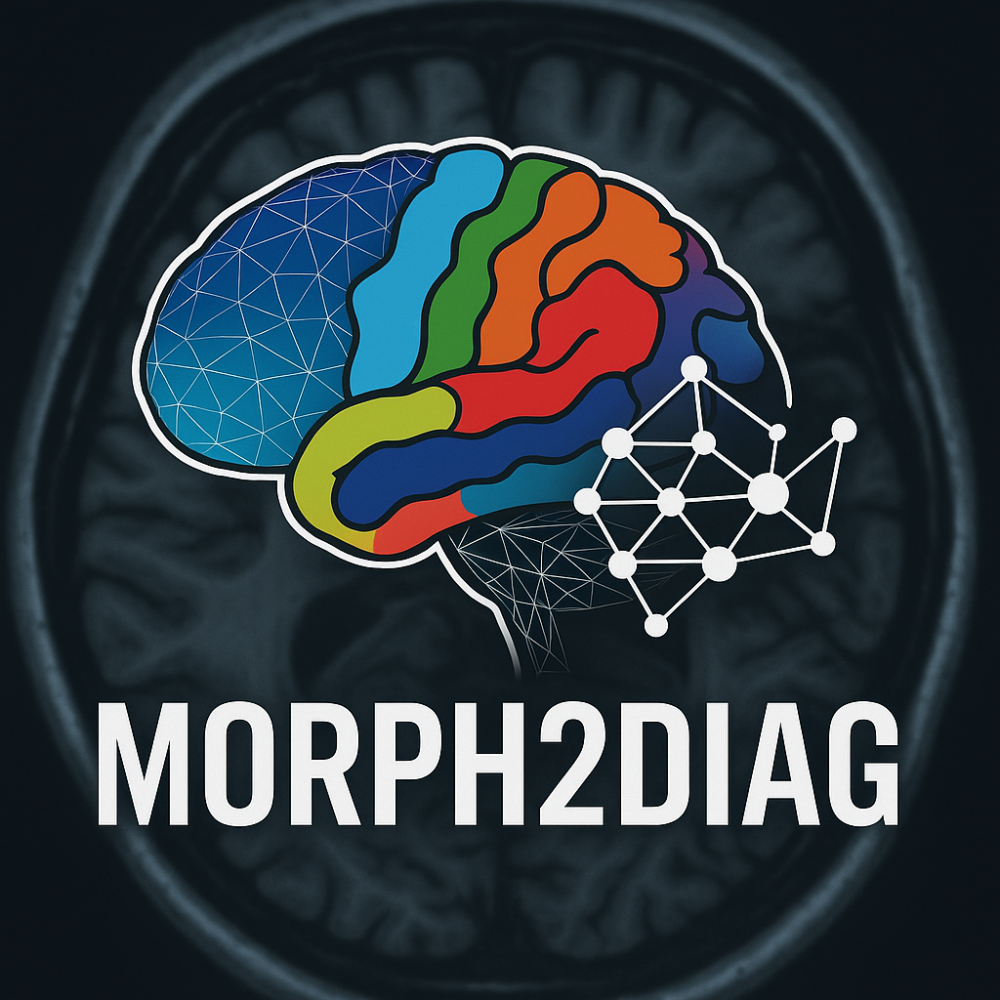

# MORPH2DIAG  (Morphometry - to - Diagnostics)
**Atlas-free, Automated Morphometric Pipeline for Structural MRI**

MORPH2DIAG is an end-to-end Python framework for standardized preprocessing, tissue segmentation, feature construction, unsupervised subtype discovery, and machine/deep-learning analysis of T1-weighted structural MRI.  
Designed for transparency, reproducibility, and full automation, MORPH2DIAG transforms raw MRI volumes into interpretable morphometric signatures—without requiring anatomical atlases or clinical labels.

<p align="center">
  
</p>

---

## Motivation
Structural MRI contains rich information about brain morphology, yet differences in preprocessing, alignment, and feature construction often lead to inconsistent or irreproducible results. MORPH2DIAG provides a **fully standardized, atlas-free pipeline** that:

- normalizes intensity across subjects,
- aligns volumes using PCA-based affine transforms,
- segments GM/WM/CSF via Gaussian Mixture Models,
- constructs regional features via voxelwise parcellation,
- discovers latent morphometric subtypes through unsupervised clustering, and
- evaluates these features and subtypes using supervised **machine learning and deep learning** classifiers.

The pipeline therefore supports both exploratory neuroanatomical analysis **and** predictive modeling, enabling robust, reproducible morphometric profiling from raw T1-weighted MRI.

---

## Key Features

- **One-command preprocessing**  
  Skull-stripped input → normalized, aligned, scaled, segmented.

- **Atlas-free GMM tissue segmentation**  
  Quantitative GM/WM/CSF maps produced without external templates.

- **Global + regional morphometric features**  
  Tissue fractions + ~100 voxelwise parcels with mean/variance descriptors.

- **Unsupervised morphometric subtype discovery**  
  K-means clustering reveals GM–CSF structural gradients.

- **Integrated supervised ML/DL suite**  
  End-to-end benchmarking of:
  - Random Forests  
  - Logistic Regression  
  - XGBoost  
  - Lean MLPs  
  - Deep MLPs  
  - Hybrid MLPs  
  with focal loss, label smoothing, stochastic weight averaging (SWA), and PCA-based dimensionality reduction.

- **Reproducible + modular framework**  
  Standardized pipeline, version-controlled outputs, and clear interfaces for extension.

---

## Pipeline Overview

```text
T1w MRI (NIfTI)
        ↓
Intensity Normalization
        ↓
PCA-Based Affine Alignment
        ↓
Isotropic Rescaling
        ↓
GMM Tissue Segmentation (GM / WM / CSF)
        ↓
Global Tissue Fractions
        ↓
Voxelwise Parcellation (~100 parcels)
        ↓
Parcel-wise Mean & Variance Features
        ↓
Unsupervised Clustering (K-Means)
        ↓
Supervised ML (RF, LR, XGBoost)
        ↓
Deep Learning (Lean MLP / Deep MLP / Hybrid MLP)
```
---

## Dataset Compatibility

MORPH2DIAG accepts any skull-stripped T1-weighted MRI in NIfTI format (.nii, .nii.gz), including:

- NFBS (Neurofeedback Skull-Stripped dataset)
- OASIS-1 / OASIS-3
- ADNI skull-stripped volumes
- FreeSurfer-, FSL-, or ANTs-derived brain extractions

Clinical labels are not required; MORPH2DIAG supports label-free morphometric analysis.

---

## Instructions

1. All NFBS images can be found within **/NFBS_Zips**
2. All code scripts can be found within **/scripts** that can be tested on the NFBS images
3. Follow the numbering per python notebook to run them in order

---

## Citation

If you use MORPH2DIAG in your work, please cite:

Bangera, S.C., et al. **MORPH2DIAG: Automated Structural MRI Preprocessing and Tissue Segmentation for Interpretable Machine and Deep Learning-Based Neuroanatomical Classification**. bioRxiv (2025). [doi:10.1101/2024.01.15.123456.](https://doi.org/10.1101/2025.11.16.688711)

